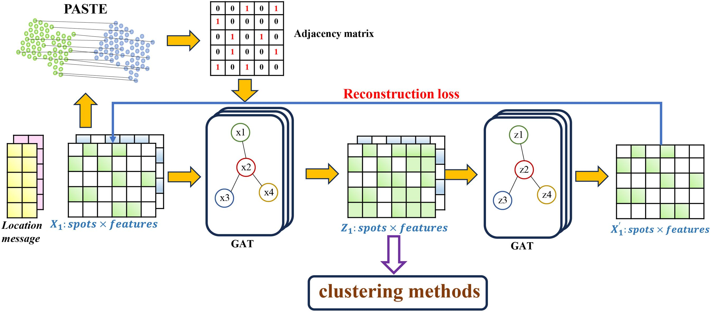

# BiGATAE
BiGATAE: a bipartite graph attention auto-encoder enhancing spatial domain identification from single-slice to multi-slices

## Data Download Link
1. [Human dorsolateral prefrontal cortex dataset](http://research.libd.org/spatialLIBD)
2. [Breast cancer dataset](https://datadryad.org/stash)
3. [Human skin squamous cell carcinoma dataset](https://www.ncbi.nlm.nih.gov/geo/query/acc.cgi?acc=GSE144239)
   
## Requirements
To execute the code, make sure to install the required packages listed below.
* python==3.8
* torch>=1.8.0
* scikit-learn==1.1.1
* matplotlib==3.4.2
* pandas==1.4.2
* numpy==1.22.3
* scanpy==1.9.1
* R==4.0.3
